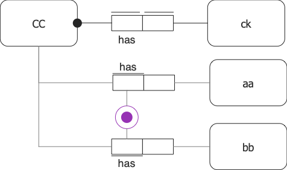
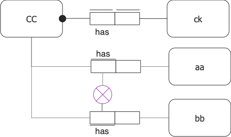
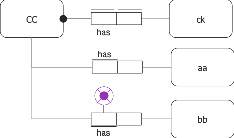
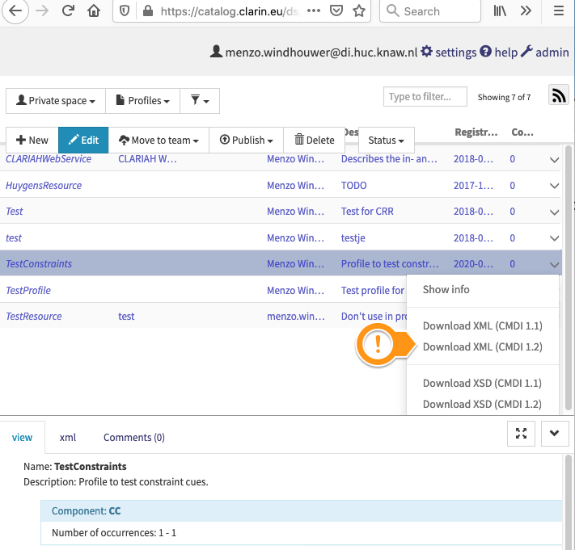
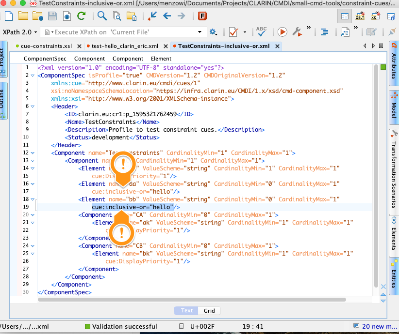

# CMDI Constraint Cues

This project provides support for a set of CMDI cues to add some validation constraints which can't be expressed in a profile/component speification and its derived XSD.

Lets assume we have a Component `CC`, which has three elements `ck`, `aa` and `bb`. Instantiating`ck` is mandatory, which can be enforced by giving it a minimum cardinality of 1. Instantiating `aa` and/or `bb` can be mandatory as well , e.g., one has to instantiate one or both of them. This can't be handeled by cardinalities, as both of them have to be optional, i.e. have a minimum cardinality of 0. Here come the constraint cues into play:

## inclusive-or

```xml
<Component name="CC" ...>
    <Element name="ck" CardinalityMin="1" .../>
    <Element name="aa" CardinalityMin="0" cue:inclusive-or="grp" .../>
    <Element name="bb" CardinalityMin="0" cue:inclusive-or="grp" .../>
</Component>
```



An inclusive-or constraint allows the following combinations of instantiating `aa` and `bb`:
1. `aa`
2. `bb`
3. `aa` `bb`

It disallows:
1. _no_ instantiation of `aa` or `bb`

## exclusion

```xml
<Component name="CC" ...>
    <Element name="ck" CardinalityMin="1" .../>
    <Element name="aa" CardinalityMin="0" cue:exclusion="grp" .../>
    <Element name="bb" CardinalityMin="0" cue:exclusion="grp" .../>
</Component>
```



An exclusion constraint allows the following combinations of instantiating `aa` and `bb`:
1. _no_ instantiation of `aa` or `bb`
2. `aa`
3. `bb`

It disallows:
1. `aa` `bb`

## exclusive-or

```xml
<Component name="CC" ...>
    <Element name="ck" CardinalityMin="1" .../>
    <Element name="aa" CardinalityMin="0" cue:exclusive-or="grp" .../>
    <Element name="bb" CardinalityMin="0" cue:exclusive-or="grp" .../>
</Component>
```



An exclusive-or constraint allows the following combinations of instantiating `aa` and `bb`:
1. `aa`
2. `bb`

It disallows:
1.  _no_ instantiation of `aa` or `bb` 
2. `aa` `bb`

## How to

1. Youn eed to add the cues to the profile/component specification. However, at the moment that is not yet possible in the editor of the Component Registry. Which means that you have to download the XML spec and localy add them.





2. Run the XSLT to generate a set of Schematron rules to validate your records.

```sh
$xsl2 -s:profile.xml -xsl:https://raw.githubusercontent.com/menzowindhouwer/small-cmd-tools/master/constraint-cues/src/main/resources/cue-constraints.xsl > profile.sch
```

3. Validate if your records comply to the constraints.

```sh
cmdi-validator -s profile.sch record.xml
```

or

```sh
SchemAnon file:$PWD/profile.sch records xml
```
## Caveats

1. constraint groups can only contain siblings